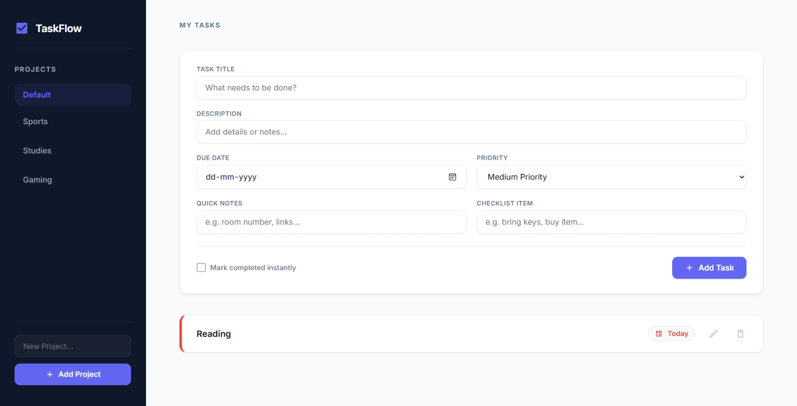

# TaskFlow 📝

TaskFlow is a modern, elegant, and professional Todo List web application built with vanilla JavaScript, modern CSS3 layout systems, and Webpack. It features a complete project structure, dynamic task lists, responsive modal editors, relative date formatting, priority tagging, and state persistence via local storage.



## ✨ Features

- **Project Management**: Organize tasks into distinct projects. Add, rename, and delete custom projects.
- **Task CRUD Operations**: Complete control over your tasks:
  - Create tasks with titles, descriptions, due dates, priorities, notes, and checklist items.
  - Edit details of any task using a modal editor.
  - Delete tasks or mark them completed instantly.
- **Dynamic Relative Dates**: Leverages `date-fns` to display relative timelines like *"Today"*, *"Tomorrow"*, and *"Yesterday"* alongside formatted dates.
- **Priority Tagging**: Color-coded badges and sidebars representing High, Medium, and Low priorities.
- **State Persistence**: All projects and tasks are automatically saved to your browser's `localStorage`, ensuring data persists across page reloads.
- **Premium UI Design**: Built from scratch using modern CSS:
  - **Glassmorphic Overlays**: Modals featuring `backdrop-filter: blur(8px)` with scale-pop entrance animations.
  - **Dark/Light Contrast**: Sleek, deep dark slate sidebar paired with a clean, light slate main workspace.
  - **Micro-interactions**: Subtle hover state translations (todo cards lift slightly) and transition effects for smooth interactivity.

---

## 🛠️ Tech Stack & Tools

- **Core**: HTML5, Vanilla JavaScript (ES6 Modules)
- **Styling**: Modern CSS3 (CSS Variables, Flexbox, CSS Grid)
- **Bundler**: Webpack 5 (Configurations for development and production)
- **Dependencies**: `date-fns` for date calculations and formatting
- **Deployment**: GitHub Pages (via Git subtree deployment)

---

## 🚀 Getting Started

To get a local copy up and running, follow these steps:

### Prerequisites
Make sure you have Node.js and npm installed on your machine.

### Installation
1. Clone the repository:
   ```bash
   git clone git@github.com:divyanshxyz/taskflow-todo-app-project.git
   ```
2. Navigate to the project directory:
   ```bash
   cd todo-list-project
   ```
3. Install the dependencies:
   ```bash
   npm install
   ```

### Running Locally
To start the development server with Hot Module Replacement (HMR):
```bash
npm run dev
```
Open [http://localhost:8080](http://localhost:8080) in your browser to view the app.

### Building for Production
To generate a minified and optimized production build in the `dist` directory:
```bash
npm run build
```

### Deployment
To push the current `dist` folder to your GitHub Pages hosting:
```bash
npm run deploy
```

---

## 📂 Project Structure

```text
├── dist/                     # Production compiled code (Git ignored)
├── src/
│   ├── css/
│   │   ├── reset.css         # Typography imports and input normalization
│   │   ├── variables.css     # CSS variable tokens (colors, shadows, margins)
│   │   ├── layout.css        # Core layout containers (Sidebar & Main content)
│   │   └── components.css    # Layout components, modals, form inputs
│   ├── images/               # Required images
│   ├── UIController.js       # Handles DOM manipulation, rendering, and UI actions
│   ├── appController.js      # Coordinates application state, storage, and callbacks
│   ├── todoCore.js           # Core class logic for Todos
│   ├── projectCore.js        # Core class logic for Projects
│   ├── storageManager.js     # Handles saving/loading from localStorage
│   ├── workspaceManager.js   # Manages active workspace and projects list
│   ├── index.js              # Entry point linking controllers and stylesheets
│   └── template.html         # HTML template used by Webpack
├── webpack.common.js         # Shared webpack settings
├── webpack.dev.js            # Development settings (Dev Server, Source Maps)
├── webpack.prod.js           # Production bundle optimization settings
├── package.json              # App scripts and package dependencies
└── README.md                 # Project documentation
```

---

## 🎓 Credits

Built as part of **The Odin Project: Todo List Project**.
